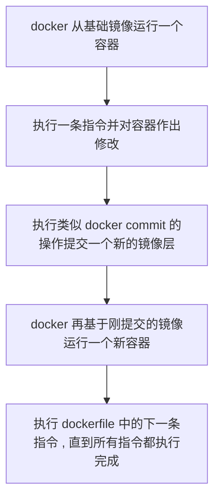

```text
Dockerfile暴力入门
运维>Docker
2022-05-07
https://picgo.kwcoder.club/202206/202206211837629.png
```


# 概述

## 是什么

[Dockerfile](https://docs.docker.com/engine/reference/builder/)，用来构建Docker镜像的文本文件，是由一条条构建镜像所需的指令和参数构成的脚本。

## 编写步骤


## 执行流程



# 常用命令

## FROM | MAINTAINER | EXPOSE | WORKDIR | USER  | VOLUME

FROM：基础镜像，即当前镜像是基于哪个镜像的，第一条必须是FROM
MAINTAINER：镜像维护者的姓名和邮箱地址
EXPOSE：当前容器对外暴露出的端口
WORKDIR：指定在创建容器后，终端默认登录进来的工作目录
USER：指定该镜像以什么样的用户去执行，如果不指定，默认是root（一般不指定）
VOLUME：容器数据卷，用于数据保存和持久化工作

## RUN

容器构建时需要运行的命令，有两种格式，分别是shell格式和exec格式。

```dockerfile
RUN yum install -y vim
RUN ["yum", "install", "-y", "vim"]
```

RUN是在docker build时运行的

## ENV

用来构建镜像过程中设置环境变量
设置的环境变量可以在后续指令中使用，例如：

```dockerfile
ENV MY_PATH /usr/my_path
WORKDIR $MY_PATH
```

## ADD | COPY

ADD：将宿主机目录下的文件拷贝进镜像（自动处理URL和tar压缩包）
COPY：类似`ADD`，但是只是单纯的拷贝

## CMD

指定容器启动后要执行的命令

- 支持`shell`格式和`exec`格式
- 在指定了`ENTRYPOINT`指令后，用CMD指定具体参数。

注意：

- 可以指定多个`CMD`指令，但只有最后一个生效，`CMD`会被`docker run`之后的参数替换

例如：

```shell
# tomcat最后一行是 CMD ["catalina.sh", "run"]
# 如果执行如下命令，tomcat服务将无法正常启动
docker run -it -p 8080:8080 tomcat /bin/bash
```

和`RUN`命令的区别：`CMD`命令是在`docker run`时运行的，`RUN`是在`docker build`时运行的

## ENTRYPOINT

和`CMD`相同，是用来指定一个容器运行时需要执行的命令，但不同的是`ENTRYPOINT`不会被`docker run`后面的命令覆盖。
通常和`CMD`命令配合使用，当`CMD`在`ENTRYPOINT`命令后时，`CMD`用于给`ENTRYPOINT`传递参数。
例如构建`nginx:test`镜像：

```dockerfile
FROM nginx

ENTRYPOINT ["nginx", "-c"]
CMD ["/etc/nginx/nginx.conf"]
```

指定的等价效果：

```shell
docker run nginx:test # nginx -c /etc/nginx/nginx.conf
docler run nginx:test /etc/nginx/new.conf # nginx -c /etc/nginx/new.conf
```

# 示例

## 构建可以ssh登录的centos7

```shell
mkdir centos7_ssh
cd centos7_ssh
vim Dockerfile
```

Dockerfile内容如下：

```dockerfile

# 基于哪个镜像
FROM centos:7

# 作者
MAINTAINER zhinushannan<zhinushannan@gmail.com>

# 设置环境变量
ENV ROOT_PASSWORD 12345678
ENV PYTHON_VERSION 3.7.4
ENV PIP_MIRROR_HOST mirrors.aliyun.com
ENV PIP_MIRROR_URL http://mirrors.aliyun.com/pypi/simple/

# 配置ssh登录：
# 安装openssh-server、openssh-clients、net-tools
# 设置root账号的密码
# 生成ssh的key
RUN yum install -y openssh-server penssh-clients net-tools && \
    echo $ROOT_PASSWORD | passwd --stdin root && \
    ssh-keygen -t dsa -f /etc/ssh/ssh_host_dsa_key && ssh-keygen -t rsa -f /etc/ssh/ssh_host_rsa_key


# 配置Python环境
RUN yum install -y zlib-devel openssl-devel libffi-devel gcc make wget && \
    cd /root/ && wget https://www.python.org/ftp/python/$PYTHON_VERSION/Python-$PYTHON_VERSION.tar.xz && \
    tar -xf /root/Python-$PYTHON_VERSION.tar.xz && rm -rf /root/Python-$PYTHON_VERSION.tar.xz && \
    cd /root/Python-$PYTHON_VERSION && ./configure && make && make install && rm -rf /root/Python-$PYTHON_VERSION

# 安装thefuck工具，启动容器后，需要依次执行才能生效：fuck, source ~/.bashrc, fuck, source ~/.bashrc
RUN pip3 install thefuck -i $PIP_MIRROR_URL --trusted-host $PIP_MIRROR_HOST && \
    echo -e "\n\n# thefuck\reval \"\$(thefuck --alias fuck)\"" >> /etc/profile

# 容器启动时，启动sshd服务
CMD ["/usr/sbin/sshd", "-D"]

# 监听22端口
EXPOSE 22

```

```shell
docker build -t centos_ssh:7 .  # 构建
docker run -d -p 9000:22 centos_ssh:7  # 启动
ssh root@10.103.3.59 -p 9000  # ssh登录，其中ip应当是本机的ip
ssh-keygen -f "/home/zhinushannan/.ssh/known_hosts" -R "[10.103.3.59]:9000"  # 删除容器后，应当删除对应的签名
```

# 虚悬镜像

`REPOSITORY`和`TAG`都是`<none>`的镜像。
查看虚悬镜像：`docker images -f dangling=true`
移除所有虚悬镜像：`docker image prune`


